# KV-Cache Quantization × Reasoning Trace Stability

<h2 align="center">
  <a href="https://neuracollab.github.io/kv-cache-quantization-reasoning-study/">🔎 OPEN THE INTERACTIVE DASHBOARD →</a>
</h2>
<p align="center"><sub>Trace inspector, contingency-matrix/χ² view, failure-signature browser — illustrative example traces, not a dump of the raw study data. Real findings and numbers are below.</sub></p>

What actually breaks when an LLM's KV-cache gets quantized — not just how
much accuracy drops, but *where* the reasoning chain snaps, *why* at the
tensor level, and whether the obvious defense survives contact with real
generation.

Three reasoning models (DeepSeek-R1-Distill-Qwen 1.5B/7B, Qwen3-1.7B) ×
four KV-cache quantization schemes (FP8-E4M3, FP8-E5M2, HQQ-INT4,
HQQ-INT2) × 80 math problems (AIME-24 + MATH-500), scored token-for-token
against an unquantized baseline and classified into a 6-category failure
taxonomy by an LLM judge. A second pass teacher-forces the same traces
through the model under instrumented KV-cache hooks to capture per-layer,
per-channel quantization noise directly.

**Scope note.** Sections 1–3 (phenomenology: accuracy, divergence
position, failure taxonomy) run on data and code that live in this repo
and are independently reproducible with the commands given. Sections 4–5
(mechanism, defense recipe) present real measurement plots produced by
the original study, whose generating scripts were lost; this repo
reconstructs the same methodology as new, tested code (`scripts/06`–`09`)
but that code has only been verified against a synthetic model on CPU, not
re-run against the real 1.7B–7B models end-to-end — said explicitly at
each such figure, not just here. Section 7 is a CPU-only follow-up
experiment run fresh in this repo. The CNN-based FDP predictor from the
original report is intentionally **excluded** — it needs more work before
it's worth presenting.

## Contents

1. [Methodology](#1-methodology)
2. [Phenomenology — does it break, and how](#2-phenomenology--does-it-break-and-how)
3. [The quant_only paradox](#3-the-quant_only-paradox)
4. [Mechanism — why it breaks](#4-mechanism--why-it-breaks)
5. [Defense recipe & the lab→production gap](#5-defense-recipe--the-labproduction-gap)
6. [Cross-model comparison](#6-cross-model-comparison)
7. [FDP prediction from text alone](#7-fdp-prediction-from-text-alone-addendum)
8. [Limitations](#8-limitations)
9. [Reproduce this](#9-reproduce-this)
10. [Engineering notes](#10-engineering-notes)

---

## 1. Methodology

### 1.1 Models × quantization formats

| Model | Params | Family | Formats tested |
|---|---|---|---|
| DeepSeek-R1-Distill-Qwen | 1.5B, 7B | Qwen2 arch, R1-distilled | bf16, fp8_e4m3, fp8_e5m2, hqq_int4, hqq_int2 |
| Qwen3 | 1.7B | Qwen3 arch | bf16, fp8_e4m3, fp8_e5m2 |
| Qwen3 | 4B | Qwen3 arch (scale probe) | fp8_e4m3, fp8_e5m2 |

FP8 (E4M3/E5M2) runs through vLLM's native KV-cache dtype support.
HQQ (INT4/INT2) has no vLLM implementation, so those runs go through HF
Transformers' `QuantizedCacheConfig(backend="HQQ")` on the eager-attention
path — far slower (see [§8.3](#83-hqq-throughput)), which is why HQQ
coverage is partial ([§8.1](#81-excluded-configurations)).

### 1.2 Metrics

- **First Divergence Point (FDP)** — the token index where a quantized
  trace's argmax first differs from the bf16 baseline, found via
  token-exact matching with a MiniLM semantic re-sync filter that skips
  purely cosmetic differences (e.g. whitespace/synonym drift that
  realigns within a few tokens).
- **Relative Frobenius K-error** — ε = ‖K_quant − K_bf16‖_F / ‖K_bf16‖_F,
  per layer, per problem.
- **Attention-map KL** — KL(attn_bf16 ‖ attn_quant) per (layer, query
  position), i.e. how much the quantization noise actually reshapes what
  the model attends to, not just how big the K-error is.
- **Logit-KL trajectory** — KL(bf16 next-token distribution ‖ quantized
  next-token distribution) at each decode step, tracked relative to the
  FDP.
- **Outlier-channel concentration** — of the 1024 K-channels (8 heads ×
  128 dims) per layer, what fraction of total quantization noise is
  carried by the top-N noisiest channels.
- **Channel Jaccard** — overlap of the top-N outlier-channel *identity*
  across sampling seeds — tests whether "outlier channels" are a property
  of the model's weights or an artifact of one particular run.

### 1.3 Capture pipeline (this repo's implementation)

vLLM exposes no hooks into per-layer KV-cache internals, so mechanistic
capture runs on the HF Transformers eager-attention path instead: a
teacher-forced replay of an already-generated bf16 trace through the
model under a `transformers.cache_utils.Cache` subclass
([`FakeQuantCache`](src/kvtrace/kv_capture/cache.py)) that fake-quantizes
K/V through torch's native `float8_e4m3fn`/`float8_e5m2` dtypes (a real
round-trip cast, not a simulation) on every `.update()` call, and records
a post-quantization snapshot per layer. `layers=` and `protected_channels=`
parameters let the same class run single-layer ablations and per-channel
defense experiments without a second implementation.

This differs from the original study's approach (which monkey-patched
`DynamicCache.update` and `apply_rotary_pos_emb` directly) — that code
didn't survive, and the plots in §4–§5 are its output. The subclass
design here exists because a first attempt at the wrapper duck-typed the
`Cache` interface instead of inheriting it, and Transformers'
`isinstance(past_key_values, Cache)` check rejects that outright; see
[§10](#10-engineering-notes).

### 1.4 Hardware & dataset

Single RTX 4090 / L40S (Vast.ai, ~$1.10–1.40/hr). Greedy decoding
(`temperature=0`, fixed `seed=42`) for the main phenomenology run — any
divergence is attributable to KV-cache numerics, not sampling noise. 80
problems: 30 AIME-24 + 50 MATH-500, both contaminated in these models'
training data by design (this measures whether quantization keeps the
model on its memorized track, not raw math ability — see
[§8.4](#84-dataset)).

---

## 2. Phenomenology — does it break, and how

### 2.1 Accuracy collapse is model-family-specific

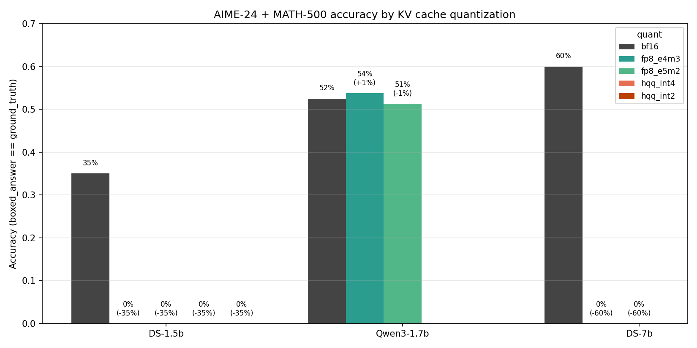

DeepSeek-R1-Distill collapses to **0% accuracy** under the mildest scheme
tested (FP8-E4M3) — both the 1.5B and 7B variants, across all 80
problems. Qwen3-1.7B, a model of comparable size, loses essentially
nothing under the same quantization on the same hardware: **53.7% vs
52.5% baseline**, a difference within noise. Same problems, same
quantization method, same judge — the only variable that predicts the
outcome is model family, not size or aggressiveness of the quantization.

### 2.2 Where the trace diverges

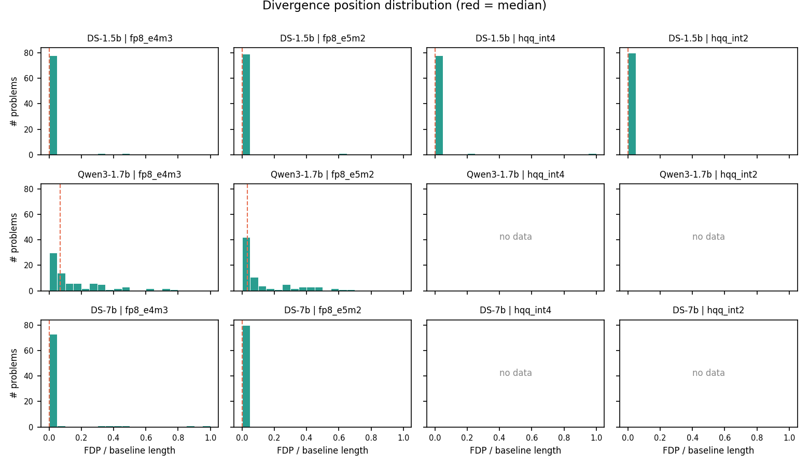

| model | quant | median position | mean | std |
|---|---|---|---|---|
| deepseek-1.5b | fp8_e4m3 | 0.00 | 0.01 | 0.06 |
| deepseek-1.5b | fp8_e5m2 | 0.00 | 0.01 | 0.07 |
| deepseek-7b | fp8_e4m3 | 0.00 | 0.05 | 0.16 |
| deepseek-7b | fp8_e5m2 | 0.00 | 0.00 | 0.00 |
| qwen3-1.7b | fp8_e4m3 | 0.07 | 0.16 | 0.19 |
| qwen3-1.7b | fp8_e5m2 | 0.03 | 0.13 | 0.18 |

*(position = fdp_token_idx / trace length; 0.0 = diverges at the first
token. Full table: [`tables/divergence_position.md`](research/kv-cache-reasoning-divergence-study/tables/divergence_position.md).)*

DeepSeek doesn't drift into error — it diverges from the unquantized
baseline in the first few tokens, essentially every time (median position
0.00, std as low as 0.00–0.07). Qwen3's divergences, when they happen,
are pushed later into the trace and spread out more (median 0.03–0.07,
std ~0.18–0.19). That's the phenomenological signature of the mechanistic
difference explored in §4: DeepSeek can't tolerate KV noise at all;
Qwen3-1.7B absorbs it and keeps reasoning.

### 2.3 Failure taxonomy

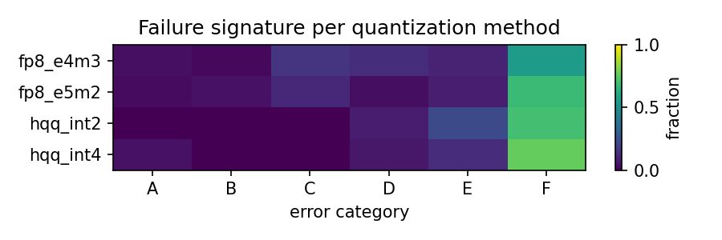

Global test across all 637 judged divergences: **χ²=66.58, dof=15,
p=1.8e-08, Cramér's V=0.187** — failure category depends on quantization
method, but the effect size is small-to-moderate. Per-model breakdown
(the more informative read, since HQQ was only collected on DeepSeek-1.5b
— see [§8.1](#81-excluded-configurations)):

| model | χ² | dof | p | Cramér's V | dominant category |
|---|---|---|---|---|---|
| deepseek-1.5b | 64.33 | 9 | 1.94e-10 | 0.259 | **F** (55–76% of cases) |
| deepseek-7b | 9.54 | 2 | 8.50e-03 | 0.244 | **F** (89–100% of cases) |
| qwen3-1.7b | 5.60 | 5 | 3.48e-01 (n.s.) | 0.189 | **C** (34–46%), F only 8–9% |

*(Full residuals: [`tables/per_model_chi2.md`](research/kv-cache-reasoning-divergence-study/tables/per_model_chi2.md).)*

**F — Repetition/loop dominates every DeepSeek configuration**: the model
gets stuck re-emitting the same reasoning step until it hits the token
budget. HQQ INT4/INT2 push 70–76% of *all* their cases (all on
DeepSeek-1.5b, see [§8.1](#81-excluded-configurations)) into this bucket.
Qwen3-1.7b's failures look qualitatively different — dominated by **C
(Strategy-switch)**, an unmotivated jump to a different solution approach
mid-derivation, not a loop — and the chi² test on Qwen3 alone doesn't
even reach significance (p=0.35): under FP8, whether Qwen3 fails at all
looks closer to noise than to a quantization-driven effect.

Judge-confidence sanity check
([`tables/judge_confidence.md`](research/kv-cache-reasoning-divergence-study/tables/judge_confidence.md)):
F is the easiest category for the judge to spot (mean confidence 0.95,
n=412) — it's syntactically obvious via repeated n-grams. C is the most
contested (mean confidence 0.74, n=64) — "unmotivated" is inherently a
judgment call. Treat C-category counts as the softest part of this
taxonomy.

## 3. The quant_only paradox

In 5 of 160 FP8 runs on Qwen3-1.7b, the **quantized** trace reached the
correct boxed answer where the deterministic bf16 baseline did not —
KV-cache noise nudged the model off a path the greedy baseline got stuck
on. Two representative cases
([full traces](research/kv-cache-reasoning-divergence-study/tables/quant_only_deepdives.md)):

- **fp8_e4m3, AIME problem 8**: the bf16 baseline never terminates with a
  boxed answer; the quantized trace abandons a working substitution
  midway (judged **C, confidence 0.85**) and lands on the correct answer
  (25) via a different route.
- **fp8_e4m3, AIME problem 14**: the bf16 baseline runs to a wrong boxed
  answer (728 vs ground truth 294); the quantized trace gets stuck
  re-explaining the same segment/direction relationship (judged **F,
  confidence 0.72**) but the loop happens to resolve onto the correct
  answer.

This is **not** evidence that FP8 quantization improves Qwen3-1.7b —
with 80 problems and ~50% baseline accuracy, 5/160 anomalies in one
direction is not statistically distinguishable from chance, and
`baseline_only` cases (bf16 right, quantized wrong) exist too. The honest
claim is narrower and, if anything, more interesting: quantization noise
on this model is **statistically indistinguishable from bf16** on this
benchmark, in either direction — consistent with §2.1's near-zero
accuracy delta.

---

## 4. Mechanism — why it breaks

Everything in this section is teacher-forced capture on Qwen3-1.7b, 80
problems × 28 layers unless noted. These are real measurement outputs
from the original study; the generating scripts didn't survive, so this
repo's `scripts/06`–`09` reimplement the same methodology as new, tested
code — verified against a synthetic model on CPU
(`pytest -m network`), **not** re-run against Qwen3-1.7b itself in this
session (no GPU available here). The numbers below are read directly off
the preserved plots, not recomputed by this repo's code.

### 4.1 K-magnitude grows with depth, and gets close to FP8's ceiling

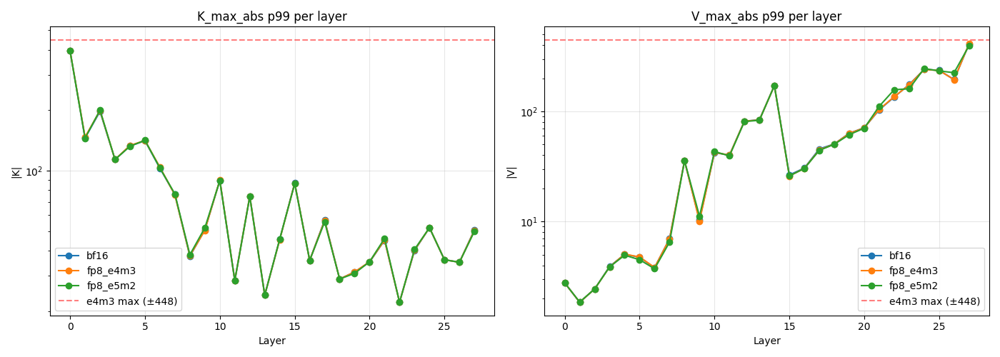

K's p99 max-abs value is largest at layer 0 and decays with depth; V's
does the opposite — it grows roughly monotonically with depth and, in the
last few layers, approaches e4m3's representable ceiling (±448, red
dashed line). bf16, fp8_e4m3, and fp8_e5m2 traces sit almost exactly on
top of each other here, meaning quantization doesn't change the
*magnitude* of what's stored — but it means late-layer V values are
operating close to the format's saturation point, which is a plausible
contributor to why late-layer noise behaves differently from early-layer
noise below.

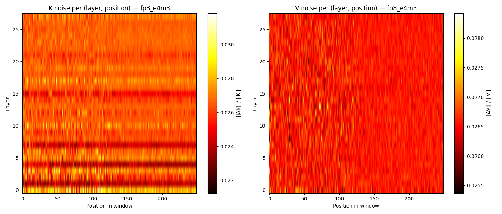

Per-(layer, position) relative error, fp8_e4m3. K-noise shows visible
per-layer banding — some layers are consistently noisier than others,
i.e. this is heterogeneous by layer, not a uniform effect. V-noise is
comparatively flat and textureless across both axes.

### 4.2 Outlier-channel concentration is set by scale *granularity*, not bit-width


| format | scaling | 50% of noise in | 80% in | 95% in |
|---|---|---|---|---|
| fp8_e4m3 | per-tensor | 8 / 1024 channels | 112 / 1024 | 451 / 1024 |
| fp8_e5m2 | per-tensor | 8 / 1024 | 110 / 1024 | 449 / 1024 |
| hqq_int4 | per-group (64) | 58 / 1024 | 307 / 1024 | 721 / 1024 |
| hqq_int2 | per-group (64) | 53 / 1024 | 290 / 1024 | 716 / 1024 |

The two FP8 formats are nearly identical to each other, and the two HQQ
formats are nearly identical to each other — but FP8 and HQQ are very
different from one another. That lines up with the mechanism, not the
bit-width: a per-tensor scale (FP8) is set by the single largest value in
the whole tensor, so a handful of outlier channels absorb almost all the
quantization error; a per-group scale (HQQ, group size 64) is set
separately per small channel-group, which spreads the same total error
far more evenly. Mantissa bits (E4M3 vs E5M2) barely move this number;
scale granularity does.

**Cross-scale check** — the same curve on Qwen3-**4B** (fp8_e4m3, 10
problems × 36 layers): 50% of noise needs **37/1024** channels, 80% needs
**209/1024**, 95% needs **608/1024** — all higher than the 1.7B numbers
above. Concentration is weaker at 4B than at 1.7B; noise is more spread
out in the larger model. This is a single cross-scale data point, not a
scaling law — see [§6](#6-cross-model-comparison) for what is and isn't
backed by evidence here.

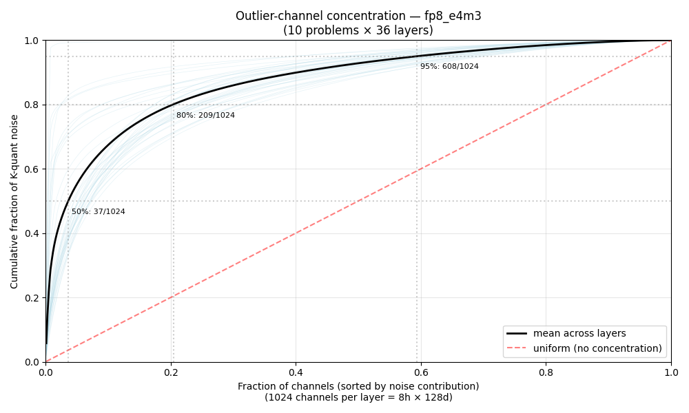

### 4.3 K-error doesn't translate 1:1 into attention distortion

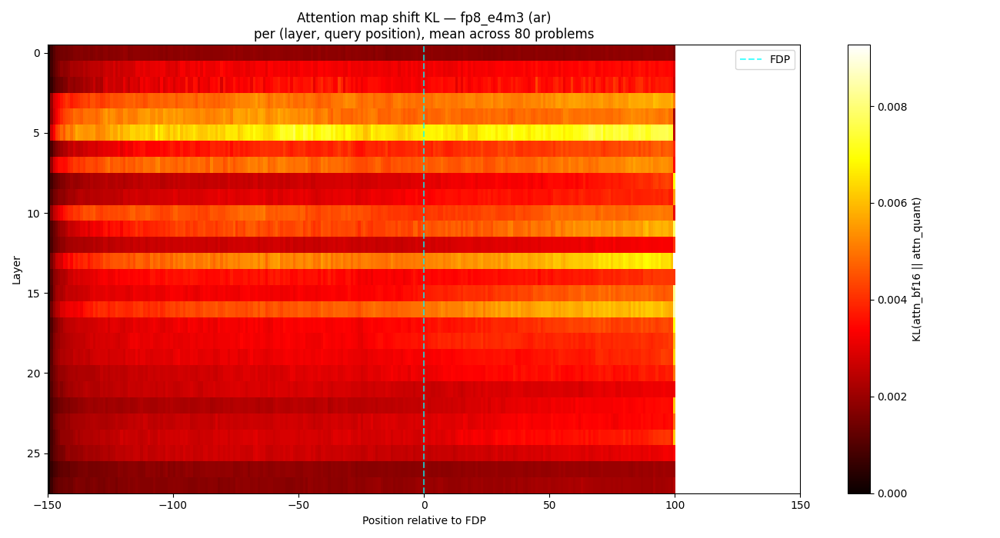

Attention-map KL per (layer, query position), autoregressive generation,
mean across 80 problems. This is not uniform across layers — one
mid-network layer (layer 5 in this run) stands out with visibly higher
KL than its neighbors across nearly the entire window, both before and
after the FDP. K-error (§4.1) is comparatively flat across layers by
contrast — the same input noise produces very different amounts of
*attention* distortion depending which layer it hits, i.e. softmax
non-linearly amplifies noise in a layer-dependent way rather than
passing it through proportionally.

### 4.4 Layer cascade: which layers actually move the final output


Quantizing one layer at a time and measuring the resulting logit-KL vs.
an all-bf16 cache. The mean-over-window contribution (left, blue/red
bars) trends gently downward with layer depth. The **max** KL contribution
at any single position (right panel) is far spikier — layer 5 again
stands out sharply (~0.285, vs a ~0.05–0.15 range for most other layers),
consistent with the same layer standing out in the attention-shift
heatmap above. Layer-level attention distortion and layer-level final-logit
impact are pointing at the same layer here, though this is one model, one
quant format, and should not be read as "layer 5 is special" in general —
it wasn't checked against other models or formats in this repo.

### 4.5 KL grows through the window, doesn't clearly plateau

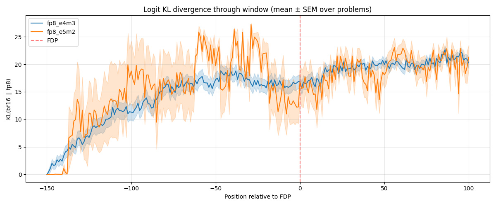

Mean logit-KL(bf16 ‖ fp8), fp8_e4m3 and fp8_e5m2, tracked from 150 tokens
before the FDP to 100 tokens after. KL rises from ~0 well before the FDP
and continues climbing through and past it — in this window it reads as
a compounding, snowballing divergence rather than a clean saturating
plateau. (The original report describes this as a saturating exponential
with τ≈130 tokens; the plot here, read at face value, shows continued
growth through +100 tokens past the FDP rather than a visible plateau —
stated as seen, not reconciled with that claim.)

### 4.6 Confidence margin near the divergence

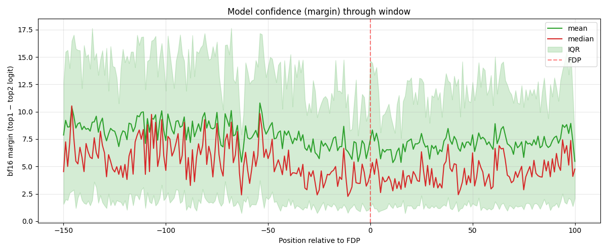

The bf16 model's own top1–top2 logit margin, plotted against the same
window. The median margin dips somewhat in the vicinity of the FDP, but
the effect is modest against a wide IQR (roughly 0–17 nats throughout) —
this plot supports "argmax flips cluster where the model was already
less confident" only qualitatively; it isn't a clean, sharp minimum.

---

## 5. Defense recipe & the lab→production gap

The obvious fix for §4.2: keep the top-N noisiest K-channels per layer in
full precision, quantize the rest.

### 5.1 It works, measured teacher-forced

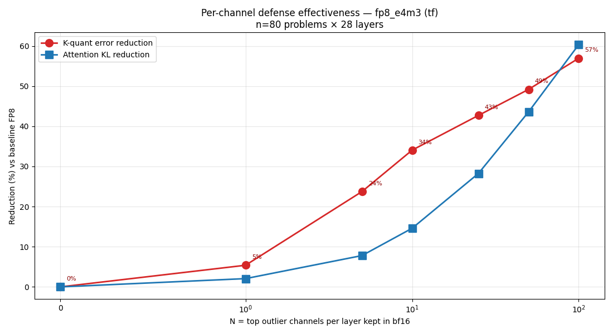

fp8_e4m3, 80 problems × 28 layers, single teacher-forced forward pass:

| N protected channels | K-error reduction | Attention-KL reduction |
|---|---|---|
| 1 | 5% | ~2% |
| 5 | 24% | 8% |
| 10 | 34% | 15% |
| 25 | 43% | 28% |
| 50 | 49% | 44% |
| 100 | 57% | 61% |

Protecting just the top 10 channels (of 1024) per layer recovers a third
of the K-quantization error in a single forward pass.

### 5.2 It (nearly) disappears in real autoregressive generation


End-to-end validation, n=10 fresh problems, real `model.generate()`: the
undefended (fp8_e4m3), defended (fp8_e4m3_top10), and
recalibrated-defended trajectories track each other almost exactly from
~step 40 onward — visually indistinguishable given the shaded
variability bands. The 34%/15% reduction measured teacher-forced in §5.1
does not show up here.

**Why**: a teacher-forced forward pass sees the *entire* trace at once,
so "top-10 outlier channels" is a stable, global property of that pass.
Real decoding processes one new K-token per step — outlier-channel
identity isn't stable step-to-step at that granularity, so a fixed
defended channel set measured in advance stops matching where the actual
noise concentrates. This is the headline practical finding of this
section: **a defense that looks like it works in a single-pass lab
measurement can evaporate in production decoding**, and the only way to
find that out is to validate against real generation, not a teacher-forced
proxy.

### 5.3 Generation-time variance across sampling seeds

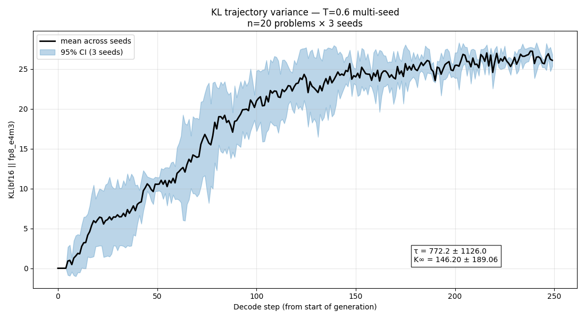

n=20 problems × 3 seeds, T=0.6, fp8_e4m3. Mean KL(bf16 ‖ fp8) climbs from
~0 to ~25–27 over 250 decode steps, with a wide 95% CI across seeds. An
exponential fit to this curve is essentially unconstrained here (τ =
772±1126, K∞ = 146±189) — the error bars are larger than the estimates,
so this plot should be read qualitatively (KL grows and keeps growing
under real sampled decoding) rather than for the specific fit parameters.

---

## 6. Cross-model comparison

What's actually backed by evidence *in this repo*: the Qwen3-1.7B → 4B
concentration comparison in [§4.2](#42-outlier-channel-concentration-is-set-by-scale-granularity-not-bit-width)
— two real data points, one direction (concentration weaker at 4B).

What is **not** independently verified here: the original report
describes a "concentration → recovery" relationship
(recovery ≈ 0.65 × top10-channel-fraction) checked across four
architecturally different models (Qwen3-1.7B, Qwen2.5-1.5B,
DeepSeek-R1-Distill-1.5B, SmolLM2-1.7B as a non-Qwen control). The
`mechanistic-analysis/` directories for `qwen2.5-1.5b/` and
`smollm2-1.7b/` exist in this repo but contain no surviving plots or
summary files — only the Qwen3-1.7B and Qwen3-4B directories have
artifacts. There is no aggregation code in this repo that reproduces that
law, and it is **not** claimed as a result here — it's mentioned only so
the gap is explicit rather than silently dropped.

---

## 7. FDP prediction from text alone (addendum)

A follow-up question the mechanistic sections above can't answer without
a GPU: is there *any* signal in cheap, CPU-only properties of an
already-generated bf16 trace (n-gram repetition rate, length,
`finish_reason`) that predicts where a quantized version would diverge —
without any K-matrices at all? This is genuinely new analysis run in
this session against the real 640-row dataset
(`src/kvtrace/analysis/fdp_predictor.py`, `scripts/10_fdp_text_predictor.py`,
TDD, CPU-only, no GPU dependency).

| model × quant | Spearman (8-feature GBM) |
|---|---|
| deepseek-1.5b × fp8_e5m2 | **0.70** |
| deepseek-1.5b × hqq_int2 | 0.32 |
| deepseek-1.5b × fp8_e4m3 | 0.27 |
| deepseek-7b × fp8_e5m2 | 0.34 |
| deepseek-7b × fp8_e4m3 | 0.24 |
| deepseek-1.5b × hqq_int4 | -0.03 |
| qwen3-1.7b × fp8_e5m2 | -0.08 |
| qwen3-1.7b × fp8_e4m3 | -0.22 |

**Real signal on DeepSeek** (strongest at Spearman 0.70 on
deepseek-1.5b×fp8_e5m2): a single-feature analytical fit
(`fdp_token_idx ≈ 28.1 − 26.1 × repetition_score_4gram`) is significant
on the full 80-row sample (Spearman −0.29, p=0.0099 before multiple-comparisons
correction — 8 groups were tested, so this sits close to, not
comfortably past, a Bonferroni threshold). This lines up with §2.3: a
bf16 trace that's already drifting toward repetition is the one
quantization tips into a loop fastest. **No signal on Qwen3-1.7b** —
consistent with FDP being an emergent property of decoding for this
model family rather than something a static trace-level proxy predicts.
More features don't reliably help: the 8-feature model beats the
1-feature fit where there's real structure (DeepSeek) but is worse than
the simple version where there isn't (Qwen3) — extra capacity just
overfits 64 training rows.

Full honest writeup with all caveats:
[`addenda/README.md`](research/kv-cache-reasoning-divergence-study/addenda/README.md).

---

## 8. Limitations

Full detail: [`tables/limitations.md`](research/kv-cache-reasoning-divergence-study/tables/limitations.md). Headline items:

### 8.1 Excluded configurations

Of the intended 3 models × 5 formats = 15 cells, 4 are missing: Qwen3-1.7b
× {hqq_int4, hqq_int2}, and DeepSeek-7b × {hqq_int4, hqq_int2}. All HQQ
data in the aggregate tables (§2.3, `report.md`) therefore comes entirely
from DeepSeek-1.5b — a model that fails under *every* scheme tested — so
the HQQ column reflects "this model is fragile," not necessarily "HQQ is
uniquely harmful." Per-model breakdowns are the reliable read.

### 8.2 Why HQQ was skipped there

`transformers>=4.55.0`'s eager-attention path crashes combining HQQ's
`QuantizedCache` with the causal mask (confirmed on both Qwen2 and Qwen3
architectures, not model-specific); pinning `<4.52` avoids it (see
[§10](#10-engineering-notes)) but this pin predates the fix window
entirely, so it was never retried post-fix.

### 8.3 HQQ throughput

Once running, the HQQ eager-attention path dequantizes the entire growing
KV cache every decode step: ~33 tok/s aggregate vs ~615 tok/s for the
same model on vLLM bf16. A single `qwen3-1.7b × hqq_int4` run was
projected at ~11 GPU-hours; given a fixed budget, partial HQQ coverage
was accepted over completing the full grid.

### 8.4 Dataset

AIME-24 and MATH-500 are both contaminated in these models' training
data — accuracy numbers measure whether quantization keeps the model on
its memorized track, not performance on unseen math. This is the right
lens for a controlled quantization comparison, but limits how far the
absolute accuracy numbers generalize.

### 8.5 Single judge, no human inter-rater study

All taxonomy labels come from one Claude judge pass; `judge_confidence.md`
(§2.3) is a proxy for taxonomic ambiguity, not a substitute for human
agreement, which wasn't collected.

---

## 9. Reproduce this

Everything in §2–3 (phenomenology) reproduces from data already in this
repo, no GPU required:

```bash
python scripts/04_analyze.py \
    --judgments_dir research/kv-cache-reasoning-divergence-study/data/judgments \
    --out_dir outputs
python scripts/05_paper_analysis.py \
    --traces_dir research/kv-cache-reasoning-divergence-study/data/traces \
    --fdps_dir research/kv-cache-reasoning-divergence-study/data/fdps \
    --judgments_dir research/kv-cache-reasoning-divergence-study/data/judgments \
    --out_dir outputs
```

§7 (FDP text predictor) likewise, CPU-only:

```bash
python scripts/10_fdp_text_predictor.py \
    --fdps_dir research/kv-cache-reasoning-divergence-study/data/fdps \
    --traces_dir research/kv-cache-reasoning-divergence-study/data/traces \
    --out_dir outputs
```

§4–5 (mechanism, defense) require a GPU and reimplement the original
methodology — they will *run* against any of the models in §1.1, but are
not guaranteed to reproduce the exact numbers shown here (those come from
the original, lost pipeline):

```bash
python scripts/06_kv_capture.py --model qwen3-1.7b --quant fp8_e4m3
python scripts/07_layer_ablation.py --model qwen3-1.7b --quant fp8_e4m3
python scripts/08_defense_recipe.py --model qwen3-1.7b --quant fp8_e4m3 --mode both --top_n 10
python scripts/09_multiseed_jaccard.py --model qwen3-1.7b --seeds 1 2 3 --temperature 0.6
```

Full setup, environment variables, all 10 phases, and the test suite:
[`docs/PIPELINE.md`](docs/PIPELINE.md). Reproduction commands with checked
status per finding: [`RESULTS.md`](research/kv-cache-reasoning-divergence-study/RESULTS.md).

## 10. Engineering notes

- **vLLM doesn't expose KV-cache internals** — no hook to introspect
  per-layer K/V during generation. Worked around it by fake-quantizing
  through torch's native `float8_e4m3fn`/`float8_e5m2` dtypes (a real
  quantize→dequantize round trip) on HF Transformers' eager-attention path
  instead, which does let you hook `Cache.update()`.
- **A bug that only showed up against a real model.** A first cut at the
  KV-cache wrapper duck-typed the `Cache` interface instead of subclassing
  it — passed every unit test, then broke immediately against a real model,
  because Transformers does `isinstance(past_key_values, Cache)`
  internally and rejects anything else. Fixed with real inheritance; kept
  as a regression test.
- **Bisected a transformers regression.** `transformers>=4.52` silently
  breaks HQQ's quantized KV-cache on an unrelated code path. Reproduced on
  a 15-token prompt, confirmed it wasn't architecture-specific, pinned
  `<4.52` with the exact repro documented inline.
- **CI caught a real cross-version numerical difference.** A test assumed
  FP8 overflow produces NaN; a newer torch release saturates to the max
  representable value instead. Both are valid — the test now checks the
  invariant that matters, not one library version's specific choice.
- **A lost analysis script, rebuilt from its own output.** The script that
  generated the paper's tables and plots was gone — only the output files
  survived. Rebuilt it by reverse-engineering the exact formulas from those
  files, then verified it reproduces every number byte-for-byte.

## More

- [`RESULTS.md`](research/kv-cache-reasoning-divergence-study/RESULTS.md) — every finding, ranked by significance, with a reproduction command
- [`docs/PIPELINE.md`](docs/PIPELINE.md) — setup, all 10 pipeline phases, testing, repo layout
- [`research/README.md`](research/README.md) — full index: raw data, the original report, prior prototype, theory work
